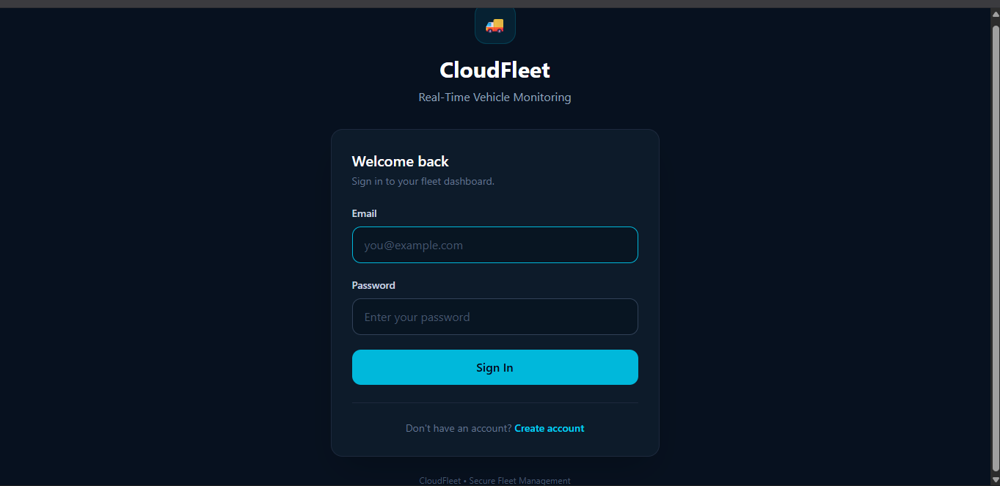
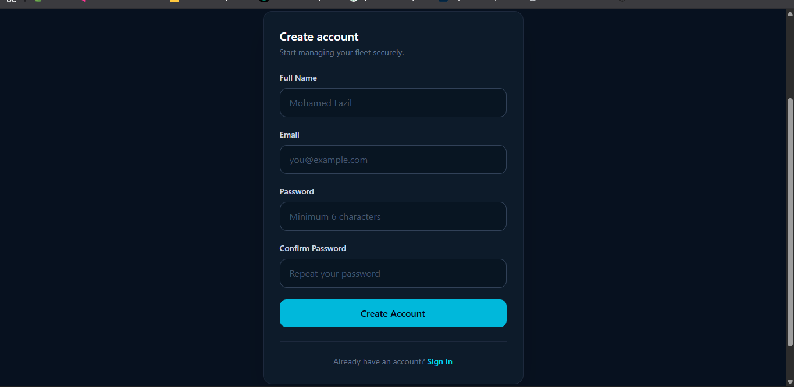
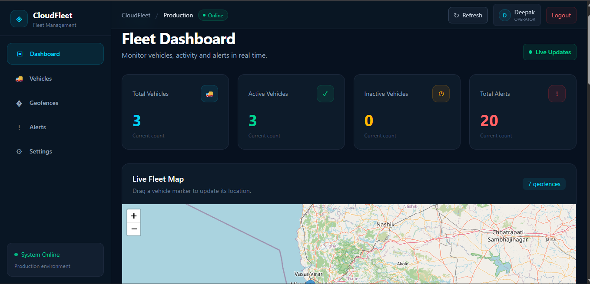
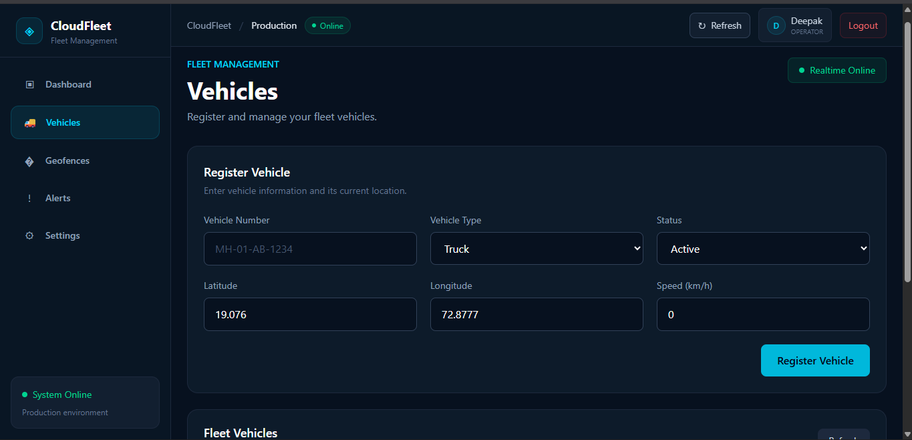
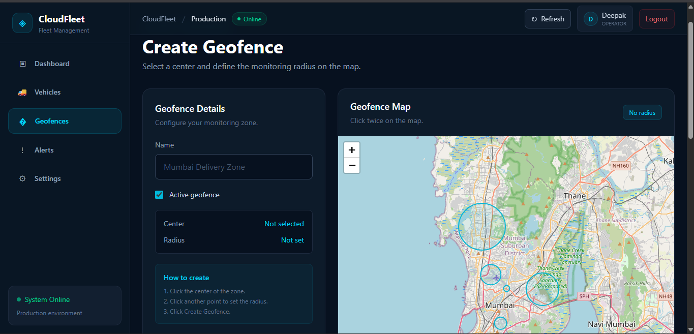
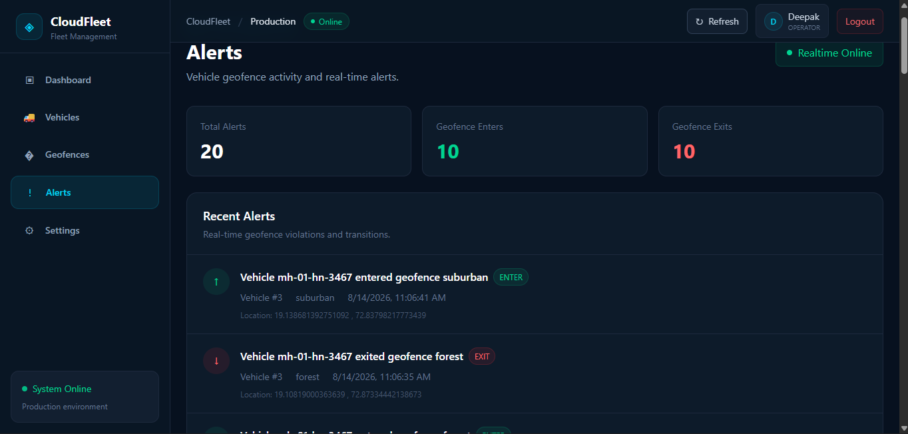

# CloudFleet Frontend

CloudFleet is a **real-time fleet management and vehicle tracking frontend** built with React and TypeScript. It provides an interactive map-based dashboard for monitoring vehicles, geofences, and real-time alerts.

## Features

- Interactive vehicle tracking map
- Real-time vehicle location display
- Geofence visualization
- Vehicle and geofence alerts
- WebSocket-based real-time updates
- REST API integration
- Responsive dashboard UI
- Tailwind CSS-based styling

## Tech Stack

- **React**
- **TypeScript**
- **Vite**
- **Tailwind CSS**
- **React Leaflet**
- **Leaflet**
- **Axios**
- **WebSocket**

## ⚠️ Current Limitation

> **Live vehicle tracking is not currently implemented.**

The current version of CloudFleet does **not track the real-time GPS location of physical vehicles**. Vehicle positions are currently updated manually through the dashboard for testing geofencing and entry/exit alerts.

### 🚧 Planned Update

Live vehicle tracking will be added in a future update, including:

- Real-time GPS location tracking
- Automatic vehicle location updates
- Continuous map updates
- Real-time movement tracking
- Improved live alerts

This feature is currently **under development**.

## Environment Variables

Create a `.env` file:

```env
VITE_API_URL=http://localhost:8080/api
VITE_WS_URL=ws://localhost:8080/ws
```

For production:

```env
VITE_API_URL=https://your-api-domain/api
VITE_WS_URL=wss://your-api-domain/ws
```

## Project Structure

```text
cloudfleet-frontend/
├── public/
├── screenshots/
├── src/
│   ├── components/
│   ├── pages/
│   ├── services/
│   ├── context/
│   ├── types/
│   ├── App.tsx
│   └── main.tsx
├── .env.example
├── package.json
├── tsconfig.json
├── vite.config.ts
└── README.md
```

## Getting Started

### Install dependencies

```bash
npm install
```

### Run development server

```bash
npm run dev
```

### Build for production

```bash
npm run build
```

### Preview production build

```bash
npm run preview
```

## Screenshots

|                      Login                       |                      Register                       |
| :----------------------------------------------: | :-------------------------------------------------: |
|  |  |

|                      Dashboard                       |                   Vehicle Booking                   |
| :--------------------------------------------------: | :-------------------------------------------------: |
|  |  |

|                      Geofences                       |                      Alerts                       |
| :--------------------------------------------------: | :-----------------------------------------------: |
|  |  |

## Frontend Architecture

```text
React UI
   │
   ├── REST API ──────► Backend API
   │
   └── WebSocket ─────► Real-time Updates
                            │
                            ├── Vehicle Locations
                            ├── Geofence Events
                            └── Alerts
```

## Production

The frontend is built as a static Vite application and can be deployed to platforms such as **Vercel, Netlify, AWS S3 + CloudFront, or Nginx**.

Production API and WebSocket endpoints are configured through environment variables.

## Author

**Mohamed Fazil**

CloudFleet — Real-Time Fleet Management Frontend
